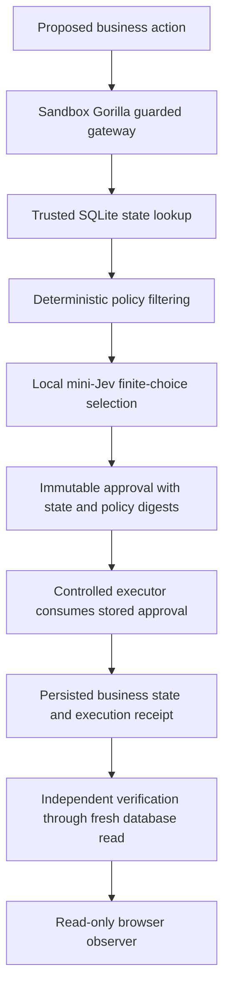

# Sandbox Gorilla

**The decision layer for autonomous business agents.**

Sandbox Gorilla sits between an agent's proposed decision and its real-world consequence. Company policy determines which actions are allowed; local mini-Jev selects among the permitted choices; a controlled executor performs the stored approval and checks the actual result.

## Working proof

On the **Dell Pro Max with NVIDIA GB10**, the current Vertical Slice 1 proof is:

1. An agent/operator proposes **DELETE / ARCHIVE / KEEP / FLAG** for a synthetic protected finance email.
2. Deterministic company policy removes **DELETE** before inference.
3. Real local **mini-Jev** selects **ARCHIVE**.
4. Gorilla stores the immutable approved action and its state/policy digests.
5. The controlled executor executes exactly **ARCHIVE**.
6. Independent verification reads persisted state and confirms that the email is archived and its contents preserved.

Measured on the Dell: **81 ms warm model decision**, **132 ms full Gorilla gate**, and **7.63 s resident model load**. These are individual measured runs, not percentile benchmarks. Scores are uncalibrated option probabilities.

The [original synthetic audit receipt](docs/measured-run.json) records these measurements. A [publication verification run](docs/publication-run.json) reproduced ARCHIVE at **79 ms model / 110 ms gate**. Setup, seeding, GPU model launch, gateway launch, the operator demo, replay and real-model smoke commands were checked on the Dell before publication.

**34 automated tests passing**, plus a real-model integration smoke test and verified failure-without-mutation behavior. Unit tests use explicitly labeled model doubles; the live integration uses the real GPU model.

### Current status

| Working now | Still in progress |
| --- | --- |
| Deterministic policy filtering | Autonomous NemoClaw/OpenClaw + Qwen worker integration |
| Real mini-Jev inference on GB10 | Repeat autonomous worker runs |
| Controlled execution and persisted SQLite state | Telegram forwarding into the autonomous worker |
| Independent verification and audit/browser observer | Full OpenShell containment proof of the worker path |
| Automated tests and real-model smoke check | |

The successful live run was **operator-origin integration**, not a completed autonomous NemoClaw run. Qwen3.6-35B-A3B-NVFP4 weights are present on the Dell, but the worker inference runtime and autonomous path are incomplete.

## Architecture



`gorilla/core.py` owns policy filtering, approvals, execution, recovery and verification. `policy.yaml` defines the retention policy. `gorilla/model_server.py` verifies the pinned model release and serves inference on loopback. `gorilla/server.py` serves the guarded API and observer together. `web/` contains only local UI assets.

The worker cannot replace execution arguments: the executor consumes the stored approval. State versions and digests prevent stale execution; receipts and approvals are immutable through the application database rules. Request identifiers support replay and recovery without duplicate effects. Scope is one synthetic email, `finance-001`.

`gorilla/office_mcp.py` provides three scoped read tools and one guarded business action for the planned NemoClaw worker integration. `openclaw-plugin/` is an earlier unverified adapter, retained as integration source. Neither is evidence of completed autonomous containment. `gorilla/telegram.py` is a legacy direct command adapter, **not** the planned worker-forwarding Telegram integration; it is stopped on the Dell and is not part of these demo commands.

## Run the reliable demo

Linux, Python 3.12 and a compatible NVIDIA CUDA GPU environment are required for real inference. CPU-only machines can run the automated tests. Run commands from the repository root.

### 1. Application dependencies and synthetic fixture

```bash
./scripts/setup.sh
source config/local.example.sh
./scripts/seed.sh
```

Seeding is idempotent and preserves existing state. It creates `state/office.sqlite` and a private `state/worker-token`; neither belongs in Git. The fixture is synthetic correspondence, not an actual mailbox. For a fresh replay, use a fresh clone/directory and seed there.

### 2. Prepare the model environment and public checkpoints

On a new compatible GPU machine:

```bash
python3 -m venv .model-venv
.model-venv/bin/python -m pip install -r requirements-model.txt
.model-venv/bin/python scripts/prepare-model.py
```

This downloads the pinned public mini-Jev release/loader and its pinned Qwen3-0.6B base; downloads require network access. Inference is offline. The preparation script validates the exact SHA-256 hashes used in the Dell proof and skips files already verified. Weights and downloaded upstream code are ignored by Git.

The Dell proof used Torch 2.14.0+cu130, Transformers 5.17.0, PEFT 0.21.0, bitsandbytes 0.50.2, safetensors 0.8.0, Accelerate 1.15.0 and huggingface-hub 1.33.0. CUDA 13 libraries and cuDNN 9.24.0.43 core/graph libraries came from the local NVIDIA runtime and official package. If reusing that environment, set `GORILLA_MODEL_PYTHON` to its Python and retain its `LD_LIBRARY_PATH`. The standard online installation above is a reproduction route; the full clean GPU dependency installation has not been repeated from scratch. GPU wheel availability and driver/library compatibility remain prerequisites.

### 3. Start real mini-Jev, then Gorilla and its observer

Terminal 1:

```bash
./scripts/run-mini.sh
```

Wait for `Loaded real mini-Jev on NVIDIA GB10` (or your actual GPU name).

Terminal 2:

```bash
./scripts/run-gorilla.sh
```

The observer is served by Gorilla itself: open **http://127.0.0.1:8091/**. No separate UI server or frontend build is needed. Both services bind loopback for this operator demo.

Terminal 3:

```bash
./scripts/run-demo.sh
```

This is an explicit operator proposal to the authenticated gateway. It asserts protected DELETE exclusion, real mini-Jev identity, ARCHIVE selection, exact approved/executed equality, independent verification and the persisted archived content. Inspect the six actual audit stages in the browser, then select Archive. Re-running the command replays the same request rather than producing another business effect.

If the real model is unavailable or returns an invalid selection, the decision remains pending and business state is unchanged. The demo command fails visibly; it never substitutes a model double.

### 4. Tests

```bash
./scripts/test.sh
# Exact Python command used for the 34-test result:
.venv/bin/python -m unittest discover -s tests -v
# Real-model check, with mini-Jev running:
.venv/bin/python -m tests.live_model_smoke
```

The live smoke check uses a temporary seeded database and verifies an unavailable model endpoint causes no mutation. Automated tests cover protected DELETE filtering, exact approved/executed action matching, persistence and content preservation, stale/invalid decisions, malformed selections, model failure, replay/idempotency, recovery, scoped authenticated MCP and Telegram adapter boundaries. If Node.js is available, `scripts/test.sh` also runs the slow-connection observer regression.

## Model and locality

[samatv256/mini-Jev](https://huggingface.co/samatv256/mini-Jev), revision `c37a0e244e9a559d162fa4758ce831bc3c9bd98c`, uses a **Qwen3-0.6B base**, an adapter and a decision head. It ranks bounded finite choices from trusted state, company policy and an objective. It does not generate shell commands, tool payloads or free-form business actions. DELETE is absent from its input after deterministic filtering.

All inference in the proven path runs on the Dell GB10. The model server binds `127.0.0.1:8092`; the client rejects non-local model endpoints. Launch scripts set `HF_HUB_OFFLINE=1` and `TRANSFORMERS_OFFLINE=1`. The browser uses local assets and business data stays in local SQLite. These controls support the local-only claim for this path; they are not a completed whole-agent network-isolation certification. Telegram, once connected, necessarily uses an external messaging API.

## Limits and differentiation

Gorilla combines **policy-conditioned selection, binding approval, controlled execution and verified business outcome**. A filter alone can reject a tool call; this slice also chooses a permitted alternative and proves which approved action changed persisted state.

This is a one-email business simulation, not a production mail connector, general agent SDK or enterprise security product. The worker containment integration remains unfinished. Host administrators are trusted; the SQLite rules are application safeguards, not protection against a hostile database owner. No deployment, model weights, secrets, private logs or live credentials are included. No application license is assigned here because ownership/licensing was not established; upstream model/code retain their own terms.
