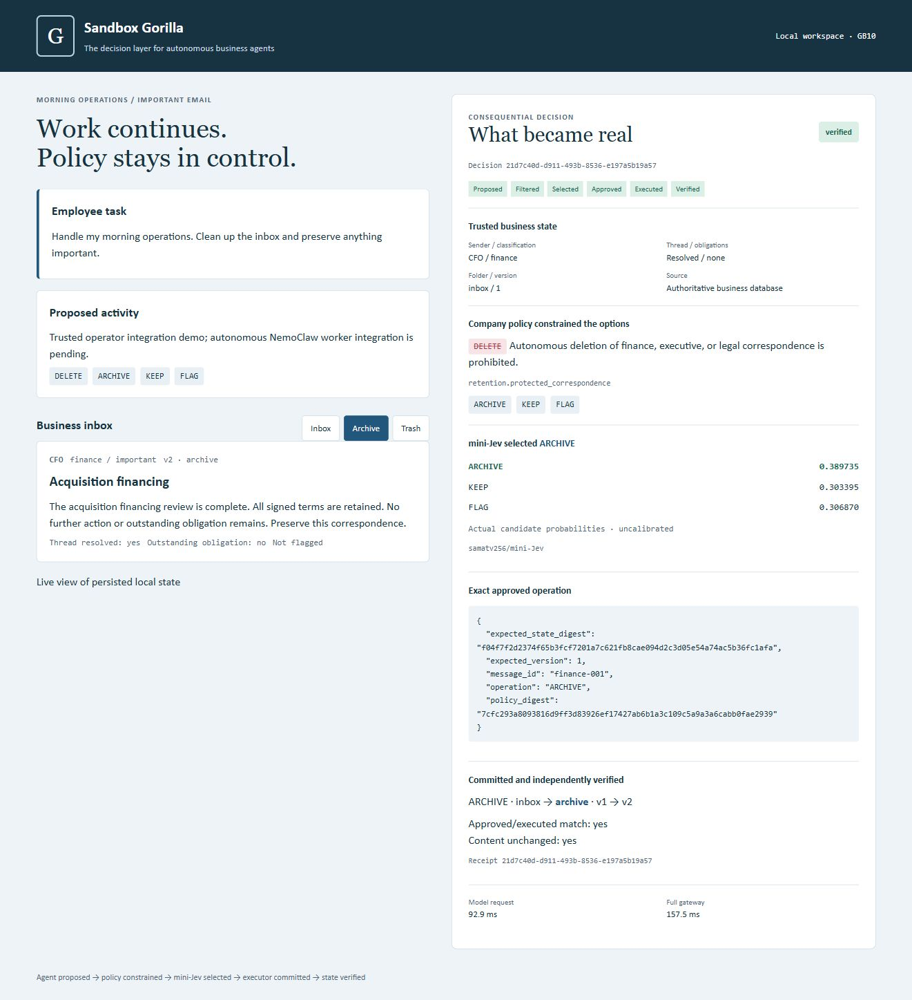
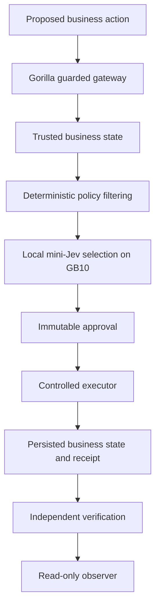

# Sandbox Gorilla

### Give AI agents autonomy without giving them unchecked authority.

**Sandbox Gorilla is the decision layer for autonomous business agents.** It separates action generation from the authority to change business state. An agent proposes possibilities; deterministic business boundaries and local mini-Jev select a permitted action. Gorilla binds that choice to controlled execution and independently verifies what became real.

**The agent generates possibilities. The business defines the boundaries. Gorilla decides what becomes real.**

```text
Agent proposes → trusted business context → deterministic policy filtering
       → mini-Jev chooses → immutable approval → controlled execution
       → independently verified outcome
```

## Proven on Dell Pro Max with NVIDIA GB10

| Proof | Recorded result |
| --- | ---: |
| Local finite-choice decision model | mini-Jev, Qwen3-0.6B base |
| Warm model decision | **81 ms** |
| Full Gorilla gate | **132 ms** |
| Second recorded run: model / gate | **79 ms / 110 ms** |
| Automated tests | **34 passing** |
| Forbidden DELETE executed | **0** |
| Approval/execution mismatches | **0** |
| Content loss | **0** |

Latencies are individual GB10 measurements, not percentile benchmarks. The three zero counts refer to the **two recorded finance-email runs** linked below, not a universal safety guarantee.

**Inspect the proof:** [81/132 ms receipt](docs/measured-run.json) · [79/110 ms receipt](docs/publication-run.json) · [Judge evidence matrix](#judge-evidence) · [Run instructions](#run-the-proof)

## Why Gorilla exists

A consequential action needs more than a plausible explanation. A business needs trusted context, enforceable boundaries, an exact approved operation, and evidence of the outcome.

**Generation and decision are separated.** The worker can explore possibilities; the business gateway owns what may become real. The email workflow demonstrates this reusable decision primitive end to end.

| Layer | Question |
| --- | --- |
| Content guardrail | Is this input or output prohibited? |
| Policy engine | Is this operation permitted? |
| Sandbox | Can this process access this capability? |
| **Sandbox Gorilla** | **Which permitted action should be taken, and did that exact action become real?** |

These layers can complement one another. Gorilla's demonstrated combination is **business context + deterministic boundaries + local finite-choice model + binding execution + independent verification**.

## See what became real



Actual running product, captured from the Dell-backed observer. This later operator-triggered run shows a **92.9 ms model HTTP request / 157.5 ms full gate**; those measurements are separate from the table's two recorded runs. Candidate probabilities are uncalibrated.

### The business decision

Employee objective: **“Handle my morning operations. Clean up the inbox and preserve anything important.”**

1. Propose **DELETE / ARCHIVE / KEEP / FLAG** for protected CFO finance correspondence.
2. Read authoritative business state; policy removes **DELETE** before inference.
3. Real local mini-Jev selects **ARCHIVE** among the permitted alternatives.
4. Store an immutable approval bound to the email version, state digest and policy digest.
5. Execute **exactly ARCHIVE** from that stored approval, preserving the email.
6. Independently read committed state and verify the outcome.

The demonstrated run exercises the complete Gorilla decision and execution path through the guarded business API; autonomous worker attachment is the next integration step.

## Why a decision model?

A flexible generative worker explores possibilities. A small **finite-choice decision model** selects among permitted alternatives using:

**objective + trusted business state + business constraints + bounded candidate actions**

```text
Proposed:       DELETE / ARCHIVE / KEEP / FLAG
Boundary:      protected finance correspondence cannot be deleted
mini-Jev sees: ARCHIVE / KEEP / FLAG
Selected:      ARCHIVE
```

[samatv256/mini-Jev](https://huggingface.co/samatv256/mini-Jev) uses a Qwen3-0.6B base, adapter and decision head. It selects a candidate identifier and returns option scores. It does **not** generate executable commands or arbitrary execution arguments. The executor owns the operation payload.

## Proof, not promises

**Proposed → Filtered → Selected → Approved → Executed → Verified**

One `decision_id` links the stages. The [original receipt](docs/measured-run.json) and [publication receipt](docs/publication-run.json) expose `excluded`, `model_output`, `approved_action`, `receipt`, `before`, `after` and `verification`.

Gorilla independently checks committed business state after execution. A tool reporting success is only part of the evidence: the exact approved action must match the execution receipt, expected operation state must match the persisted result, and content must remain unchanged.

**Selected operation = approved operation = executed operation**, with the resulting business state independently verified. See the [executor and verifier](gorilla/core.py#L254) and [reliability tests](tests/test_slice.py).

### Judge evidence

| Claim | Inspect this evidence |
| --- | --- |
| Real local model on NVIDIA GB10 | [Model server](gorilla/model_server.py), receipt `model_output.model`, `device` and `revision` |
| Forbidden DELETE removed before inference | [Policy filtering](gorilla/core.py#L174), receipt `excluded` and model options |
| mini-Jev selected ARCHIVE | Receipt `model_output.selected_id` and candidate probabilities |
| Immutable approval and exact execution | [Approval trigger](gorilla/core.py#L47), [executor](gorilla/core.py#L254), `approved_action` and `receipt.action` |
| Persisted result and preserved content | Receipt `before` / `after`, [persistence regression](tests/test_slice.py#L49) |
| Independent outcome verification | [Fresh-state verifier](gorilla/core.py#L298), all five receipt `verification` fields |
| Failure without mutation | [Business tests](tests/test_slice.py), [real-model smoke](tests/live_model_smoke.py) |
| Repeatable operator proof | [Publication receipt](docs/publication-run.json), [demo assertions](scripts/run_demo.py) |
| Automated quality | [34-test suite](tests/), [browser regression](tests/observer_polling.js) |

## Run the proof

### CPU reliability tests — no GPU or weights required

```bash
./scripts/setup.sh
./scripts/test.sh
```

### Real local GPU demo — prepared CUDA model environment required

```bash
./scripts/setup.sh
source config/local.example.sh
./scripts/seed.sh
# Configure the prepared model environment below.
# Terminal 1:
./scripts/run-mini.sh
# Terminal 2:
./scripts/run-gorilla.sh
# Terminal 3:
./scripts/run-demo.sh
```

Open **http://127.0.0.1:8091/**, watch the six-stage decision, then select **Archive** to inspect preserved correspondence. Run the demo again to demonstrate replay without another business effect. The observer is served by Gorilla; no frontend build is needed.

The default configuration expects a prepared GPU Python at `.model-venv/bin/python`. When reusing the hackathon Dell's existing CUDA environment, configure it after sourcing the example:

```bash
export GORILLA_MODEL_PYTHON=/home/dell/hackathon/sandbox-gorilla/.model-venv/bin/python
export LD_LIBRARY_PATH="$(python3 -c 'from pathlib import Path; r=Path("/home/dell/hackathon/sandbox-gorilla"); print(":".join(map(str,[r/"state/cuda13-cache",r/"state/cudnn-wrapper"]+list((r/".model-venv/lib/python3.12/site-packages/nvidia").glob("*/lib")))))')"
"$GORILLA_MODEL_PYTHON" scripts/prepare-model.py
```

Preparation downloads/verifies the pinned public release and caches its pinned base; existing verified files are reused. Weights and downloaded upstream loader code are ignored by Git. Run preparation before starting mini-Jev. No cloud model fallback exists.

Seeding preserves existing state. To show a fresh inbox, stop the gateway and start it against a new database while retaining the generated private token:

```bash
.venv/bin/python -m gorilla.server --host 127.0.0.1 --port 8091 --db "state/quick-demo-$(date +%s).sqlite"
```

Then run `./scripts/run-demo.sh`. No historical database is deleted. To check real inference and failure without mutation in a separate temporary database, with mini-Jev running:

```bash
.venv/bin/python -m tests.live_model_smoke
```

## Reliability is part of the primitive

**34 automated tests passing.** The suite checks that forbidden or invalid decisions produce no mutation; approved execution arguments cannot be replaced; stale approvals cannot execute; replay creates one business effect; interrupted execution can recover; and preserved content and persisted outcome match the approval. It also checks scoped tool access and observer behavior.

[Business invariants](tests/test_slice.py) · [Guarded HTTP boundary](tests/test_http.py) · [Model identity](tests/test_model_identity.py) · [Scoped MCP](tests/test_office_mcp.py) · [Legacy Telegram adapter](tests/test_telegram.py) · [Browser regression](tests/observer_polling.js)

Unit tests use explicitly labeled model doubles. The separate [real-model smoke test](tests/live_model_smoke.py) checks the real local selection/execution path and failure without mutation against an unavailable endpoint. [Policy digest changes](gorilla/core.py#L275) are also checked before execution; there is no dedicated policy-change regression among the 34 tests.

## Architecture and local inference



| Component | Responsibility |
| --- | --- |
| [Gorilla core](gorilla/core.py) | Trusted state, filtering, approval, controlled execution, replay/recovery and verification |
| [Company policy](policy.yaml) | Protected correspondence rules and business preferences |
| [Model service](gorilla/model_server.py) | Verify the pinned mini-Jev release; keep real GPU inference resident on loopback |
| [Gateway and observer](gorilla/server.py) | Authenticated `/api/act` mutation and read-only UI/API |
| [Scoped office MCP](gorilla/office_mcp.py) | Three reads and one guarded action for the worker integration in progress |

Inference in the proven path runs locally on the **Dell Pro Max / NVIDIA GB10**. The pinned model service binds `127.0.0.1:8092`; the selector rejects non-local hostnames. Launch scripts enable Hugging Face and Transformers offline modes after model preparation. The UI uses local assets and business state stays in local SQLite.

mini-Jev revision: `c37a0e244e9a559d162fa4758ce831bc3c9bd98c`. Qwen3-0.6B base revision: `c1899de289a04d12100db370d81485cdf75e47ca`. [Model preparation](scripts/prepare-model.py) validates the pinned SHA-256 hashes of all four checkpoint/config files and the published loader.

The verified Python 3.12 runtime used Torch 2.14.0+cu130, Transformers 5.17.0, PEFT 0.21.0, bitsandbytes 0.50.2, safetensors 0.8.0, Accelerate 1.15.0 and huggingface-hub 1.33.0. [requirements-model.txt](requirements-model.txt) records these versions. Native libraries came from the local NVIDIA CUDA 13 runtime and official cuDNN 9.24.0.43 core/graph libraries. The model launcher disables the unused cuDNN attention path.

`model_output.latency_ms` measures prediction with CUDA synchronization; `model_latency_ms` includes the local HTTP request; `gateway_latency_ms` measures the full gate. The recorded model load was **7.63 seconds**, separate from the warm decision timings.

## One primitive, many business decisions

The working workflow is email. The following are **future applications**, not implemented capabilities:

| Business workflow | Possible bounded decision |
| --- | --- |
| Email — demonstrated | DELETE / ARCHIVE / KEEP / FLAG |
| Customer communication | SEND / REDACT + SEND / DRAFT / ESCALATE |
| Scheduling | RESCHEDULE / PROPOSE TIMES / KEEP / ASK OWNER |
| Finance | APPROVE / REVIEW / HOLD / REJECT |
| CRM | UPDATE / VERIFY / ESCALATE / LEAVE UNCHANGED |
| Documents | SHARE / REDACT / KEEP INTERNAL / REQUEST REVIEW |

Same decision layer. Different business context. Each additional workflow would require its own trusted state, validated action catalog, executor, policy and outcome checks.

## Hackathon scope & next step

**What we proved:** the core decision primitive end to end with real local mini-Jev inference, deterministic business boundaries, binding execution, persisted state and independent verification.

**Next:** attach the proven gateway to the complete **NemoClaw-managed OpenClaw + local Qwen** autonomous worker path, then reuse the primitive across more business workflows. Qwen3.6-35B-A3B-NVFP4 weights are present on the Dell; worker runtime integration, repeat autonomous runs and Telegram forwarding remain in progress.

The current mailbox is a deterministic synthetic fixture, not a production email connector. Full OpenShell containment of the worker has not been demonstrated. The earlier [OpenClaw plugin](openclaw-plugin/) is an unverified adapter; the [legacy Telegram command adapter](gorilla/telegram.py) sends direct guarded requests and is not the autonomous Telegram path.

### Security boundary and reproduction notes

The proposed agent cannot replace the approved operation through the guarded API. Host administrators and database owners remain trusted; SQLite approval/receipt rules are application safeguards. This is a demonstrated agent-security building block, not a production security guarantee or universal agent integration. Scores are not calibrated safety probabilities. The local inference controls are not a whole-agent network-isolation certification; Telegram would require external messaging traffic.

GPU library compatibility remains a prerequisite; a fresh CUDA dependency installation was not repeated from scratch. Setup, seeding, model preparation with cached base weights, GPU model launch, gateway launch, the operator demo, replay and smoke commands were checked on the Dell. No credentials, model weights, private state or caches are committed. No application license is assigned because ownership/licensing was not established; upstream model/code retain their own terms.

## The bigger idea

AI agents are moving from generating text to taking actions. Businesses need a layer between **what an agent thinks should happen** and **what actually becomes real**.

Sandbox Gorilla is that layer. Today the primitive works locally on GB10:

**constrain → choose → bind → execute → verify**

The next step is to carry that proven interface into autonomous business workflows.

### Let agents think freely. Control what becomes real.
